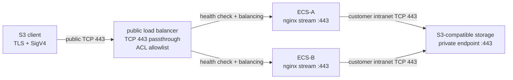

# s3-l4-proxy

[简体中文](README.md) | English · [Documentation site](https://scott987-cmd.github.io/s3-l4-proxy/)

Layer-4 (TCP 443 passthrough) proxy toolkit for reaching an **S3-compatible object storage private endpoint** from outside the customer network.

A four-layer load balancer forwards TCP 443 to `nginx stream` on customer ECS hosts, which forward to the object storage private endpoint. The proxy **does not terminate TLS**, **does not modify the HTTP/S3 request**, and **holds no object-storage credentials** — the client keeps end-to-end encryption and signature fidelity all the way to the bucket.



Because the data path is raw TCP, it is vendor-neutral. The tested implementation forwards to Volcengine TOS; the same proxy forwards to AWS S3, Alibaba OSS, Huawei OBS, MinIO, or Ceph RGW when the client hostname, TLS certificate, signing algorithm, and private backend endpoint are mutually compatible.

## Why this design

**Performance — the proxy is not the bottleneck.** No decryption, no reassembly, no HTTP parsing, no signature recomputation, no TLS termination and no second handshake. Measured single-connection throughput reached 78–98 MB/s, already close to the test instance NIC ceiling: forwarding itself adds no meaningful cost, and more throughput is one larger instance away.

**Stability — a failure surface small enough to enumerate.** No certificate on the proxy means no expiry or rotation failures. No credential means no key-expiry failures. No session state means a sick node is simply dropped by the health check and connections re-establish elsewhere. The fixed upstream removes the periodic connection resets a variable `proxy_pass` causes, and cross-AZ N+1 plus automatic rollback covers what is left.

**Operations — one command to deploy, one to watch.** Deploy, inspect, accept and operate are one command each, and `health` exits 0/1/2 straight into monitoring. Certificate rotation takes no action here, key rotation takes no action here, backend DNS changes are picked up by a timer, and scaling out is the same config on a new host added to the backend group. There is no recurring manual task.

**Cost — fully open source, no licence fees.** The data path is nginx plus `ngx_stream_module` from the distribution's own repositories: no closed-source component, no licence, no metered middleware, no vendor lock-in. The whole footprint is two ECS hosts and one L4 load balancer, and since nothing is decrypted or parsed the CPU goes to network I/O, so ordinary instance sizes are enough.

**Compatibility — nothing to adapt per vendor.** Differences in signing algorithm variants, path-style versus virtual-hosted addressing, proprietary extension headers, non-standard error bodies and vendor-specific authentication all pass through untouched. Anything that must *understand* the S3 protocol has to be adapted to each vendor's dialect, and smaller vendors and self-hosted storage (MinIO, Ceph RGW) differ most in exactly those places. This design parses none of it, so "that vendor is not supported yet" does not arise: whether it works depends only on whether the client and the storage agree with each other.

## Quick start

On the ECS proxy node:

```bash
cp config.example.env config.env
# edit config.env: S3_BACKEND_HOST, S3_BACKEND_PORT, S3_CLIENT_HOST, S3_REGION, LISTEN_PORT, LB_IP
sudo bash scripts/install_l4_proxy.sh CONFIG=config.env
bash scripts/verify_l4_proxy.sh -c config.env
```

From a client machine that can reach the load balancer VIP/EIP:

```bash
S3_ACCESS_KEY=... S3_SECRET_KEY=... LB_IP=<lb-ip> \
S3_CLIENT_HOST=<signed-host> S3_REGION=<region> \
  bash scripts/speed_test_l4.sh
```

The test keeps `S3_CLIENT_HOST` as both the TLS SNI and the signed host, and uses curl `--resolve` only to force TCP to the load balancer — certificate validation and host-signing semantics are preserved.

## One-command operations

```bash
# Deploy
sudo bash scripts/install_l4_proxy.sh CONFIG=config.env

# Check (read-only node verification)
bash scripts/verify_l4_proxy.sh -c config.env

# Accept — add RUN_SPEED=1 for a real PUT/GET/MD5 through the load balancer
S3_ACCESS_KEY=... S3_SECRET_KEY=... \
  bash scripts/acceptance_l4_proxy.sh CONFIG=config.env RUN_SPEED=1

# Operate
bash scripts/ops_l4_proxy.sh status   CONFIG=config.env
bash scripts/ops_l4_proxy.sh health   CONFIG=config.env
sudo bash scripts/ops_l4_proxy.sh reload  CONFIG=config.env
sudo bash scripts/ops_l4_proxy.sh restart CONFIG=config.env
bash scripts/ops_l4_proxy.sh upstream CONFIG=config.env
bash scripts/ops_l4_proxy.sh conns    CONFIG=config.env

# Emergency egress unlock
sudo bash scripts/ops_l4_proxy.sh unlock-egress CONFIG=config.env

# Build a credential-free delivery archive -> dist/s3-l4-proxy.tgz
bash scripts/package_l4_proxy.sh
```

## Files

| Path | Purpose |
| --- | --- |
| `config.example.env` | Copy to `config.env` before any local test or deploy. |
| `scripts/install_l4_proxy.sh` | Install nginx if needed, then configure the L4 proxy, then verify. |
| `scripts/deploy_nginx.sh` | nginx + stream module installation across CentOS/RHEL and Debian/Ubuntu. |
| `scripts/configure_l4_proxy.sh` | Write the nginx stream config, apply hardening, reload — with backup and rollback. |
| `scripts/verify_l4_proxy.sh` | Read-only node verification. |
| `scripts/ops_l4_proxy.sh` | Day-2 operations entrypoint. |
| `scripts/acceptance_l4_proxy.sh` | Production acceptance orchestration. |
| `scripts/speed_test_l4.sh` | S3 PUT/GET/DELETE throughput and integrity test through the load balancer. |
| `scripts/diag_clb_l4.sh` | load balancer/backend connectivity diagnosis, no credentials required. |
| `scripts/package_l4_proxy.sh` | Build a delivery archive, with a credential scan that fails the build. |
| `templates/nginx-main.conf` | Optional full nginx main config for dedicated proxy hosts. |
| `templates/s3-stream.conf` | Rendered stream proxy config (the one actually deployed). |
| `templates/nginx-s3-proxy.conf` | Standalone reference config, for reading rather than deploying. |
| `templates/dns-reload.{service,timer}` | Graceful reload timer that refreshes backend DNS. |
| `templates/sysctl.conf`, `templates/logrotate.conf` | Network baseline and log rotation. |

## Prerequisites

1. The ECS host can resolve and reach `S3_BACKEND_HOST:S3_BACKEND_PORT` — use the **private** endpoint in production.
2. The client uses `S3_CLIENT_HOST` for TLS SNI and request signing, and DNS (public, private, or controlled resolution) routes that hostname to the load balancer.
3. The certificate returned by the object storage covers `S3_CLIENT_HOST`, or the vendor offers an equivalent endpoint/SNI pair.
4. The client's signing protocol is accepted by the target endpoint — region, service and endpoint family must match.
5. The load balancer listener is TCP (layer 4); no device in the path modifies TLS or the application-layer request.
6. Production runs at least two ECS hosts across availability zones, with TCP health checks and N+1 capacity headroom.

## Not a fit when you need

- Virtual AK/SK translation, STS, credential brokering, delegated or re-signing.
- Host/path rewriting, path-style ↔ virtual-hosted conversion, cross-vendor protocol translation.
- HTTP WAF, header/body inspection, object-level rate limiting, tenant authz, object-level audit, or content scanning.
- A client hostname the backend certificate does not cover, with no compatible endpoint/SNI relationship available.
- load balancer ACLs, security-group allowlists, or multi-backend HA that your environment cannot provide (exposing a single bare ECS public IP is not an acceptable substitute).

## Security model

| Layer | Control | Production requirement |
| --- | --- | --- |
| Data | Client-side encryption | Encrypt sensitive data with the customer KMS before it leaves the client side; proxy and storage only ever see ciphertext. |
| Transport | End-to-end TLS | Neither load balancer nor nginx terminates TLS; no certificates or private keys on the proxy. |
| Ingress | load balancer ACL + security group | Allow only the client's fixed egress IPs; ECS 443 accepts only load balancer/approved sources. |
| Proxy | Host and egress narrowing | Dedicated host listens on 443/22 only; egress limited to DNS, ops dependencies, and the storage private endpoint. |
| Storage | Least privilege + source restriction | Dedicated sub-account/role scoped to the target bucket; bucket policy pinned to the proxy's real source address. |

- **Enough for most deployments.** Authorization and object-level audit are authoritative in the object storage itself — IAM, bucket policy and audit log all take effect there. Not re-implementing them at the proxy does not make them absent, while decrypting mid-path would add a component holding both plaintext and keys: one more place to defend, rotate and audit.
- **L4 visibility boundary.** The proxy cannot see encrypted HTTP/S3 semantics, so it does not log bucket, object key, access key, or action. `nginx stream` logs only source, duration, bytes, status and upstream. Object-level traceability comes from the client and the storage audit log; the proxy not collecting it also means no new data-retention surface.
- **No `ssl`/`ssl_certificate` directives** appear in the generated stream config, and `configure_l4_proxy.sh` fails the run if the rendered config ever contains a variable `proxy_pass`.
- **PROXY protocol is off by default.** Set `ENABLE_PROXY_PROTOCOL=1` only when the load balancer listener explicitly enables it — a mismatch breaks plain TLS clients.
- **Egress lock is off by default** so it cannot strand a host with other outbound dependencies. When enabled it uses a dedicated `S3_L4_EGRESS` chain and never flushes existing `OUTPUT` rules; `ops_l4_proxy.sh unlock-egress` reverses it.
- **Credentials never touch the repo.** `config.example.env` holds placeholders only, `.gitignore` blocks `config.env`, and `package_l4_proxy.sh` fails the build if a key-shaped string or private key reaches the archive. Verification scripts read AK/SK from the process environment — note that `speed_test_l4.sh` hands them to `curl --aws-sigv4 --user`, so on a shared host they are briefly visible in the process list; use a dedicated least-privilege test credential.

## What the installer does

- Handles nginx + the dynamic `stream` module on CentOS/RHEL and Debian/Ubuntu.
- Backs up nginx config, systemd limits, sysctl, logrotate and iptables to `/var/backups/s3-l4-proxy/<timestamp>` **before** changing anything, and rolls all of it back automatically if any step or `nginx -t` fails.
- Sets `worker_rlimit_nofile` / systemd `LimitNOFILE` (default 65535), the network sysctl baseline, stream access logging and log rotation.
- Installs `s3-l4-dns-reload.timer` to gracefully reload nginx every 5 minutes.

> On a dedicated proxy host the installer defaults to `MAIN_MODE=replace` and installs a minimal known-good stream-only nginx main config (after backup). When co-locating with an existing nginx HTTP service you must explicitly set `MAIN_MODE=auto` and `DEDICATED_PROXY_HOST=0`, and review the port/change impact separately.

### Design note: why the upstream is not a variable

Earlier generations of this proxy used a variable stream upstream (`proxy_pass $endpoint:443`). That forces nginx's stream runtime resolver path and was observed to cause periodic connection resets at roughly 5-second intervals. This toolkit uses a **fixed** `upstream s3_backend` block instead, which nginx resolves once at start/reload. The tradeoff is that backend DNS changes need a reload — which is exactly what the DNS reload timer provides.

## Vendor compatibility

The proxy moves TCP bytes and passes vendor differences through untouched, so network-layer compatibility risk with long-tail object storage is as low as it gets — "that vendor is not supported yet" does not arise.

What this compatibility is, precisely: **TCP/TLS data-plane** compatibility. Whether a combination works depends on the client and the storage agreeing with each other — the certificate covering the client host, the signing protocol being accepted — and the proxy neither participates in that nor can compensate for it. Always validate go-live with the real client SDK/CLI: PUT, GET, HEAD, multipart, and integrity checks.

| Object storage | Status | What to verify |
| --- | --- | --- |
| Volcengine TOS | Verified in a real deployment | `tos-s3-*` endpoint family; service is `s3`. |
| AWS S3 / S3 VPC endpoint | Compatible by design | Endpoint, region, service, and a client host the certificate covers. |
| Alibaba OSS | Compatible at TCP layer | Confirm the client uses a signing protocol OSS supports (or its S3 compatibility mode). |
| Huawei OBS | Compatible at TCP layer | Confirm endpoint, certificate, and signature algorithm line up. |
| MinIO / Ceph RGW | Usually compatible | Private CA trust, path-style vs virtual-hosted, SigV4 configuration. |

`speed_test_l4.sh` uses curl SigV4 and therefore suits AWS-SigV4-compatible endpoints. For vendor-specific authentication, use the vendor CLI/SDK while keeping the same load balancer hostname resolution path.

## Observability

| Dimension | Signal | Suggested alert |
| --- | --- | --- |
| Liveness | nginx, 443 listener, healthy load balancer backends | Any node down, or healthy backends below N+1 |
| Connections | ESTABLISHED, TIME_WAIT, connect failures | Above 80% of designed capacity |
| Throughput | NIC in/out bps, stream bytes | Sustained near 80% of instance bandwidth |
| Latency | `upstream_connect_time`, `session_time` | Connect P99 above the capacity baseline |
| Resources | CPU, memory, file handles, packet loss | CPU or handles above 80% |

Stream access log: `/var/log/nginx/s3-stream.log` (rotated daily, 15 generations).

## Production checklist

- [ ] At least two ECS nodes in different availability zones behind the same public load balancer
- [ ] load balancer TCP health check targets the same `LISTEN_PORT` as business traffic
- [ ] load balancer ACL and ECS security group allow inbound 443 only from the client's fixed egress / the load balancer
- [ ] nginx `stream` module loaded and `nginx -t` passes
- [ ] Active stream config uses `proxy_pass s3_backend`, not `proxy_pass $...`
- [ ] `worker_rlimit_nofile` and systemd `LimitNOFILE` at least 65535
- [ ] `/var/log/nginx/s3-stream.log` collected and rotated
- [ ] `s3-l4-dns-reload.timer` enabled so backend DNS changes are picked up
- [ ] `ENABLE_PROXY_PROTOCOL` matches the load balancer listener on both sides
- [ ] Egress lock enabled only after validating DNS, SSH, monitoring and backend allow rules
- [ ] Object storage principal, bucket/object resources and source-IP policy saved and verified in the console
- [ ] Real S3 PUT/GET/MD5 through the load balancer passes before cutover
- [ ] Capacity test meets peak demand with headroom

## Known limits

- nginx resolves non-variable upstream hostnames at start/reload time — reload when backend DNS changes (the timer does this).
- The proxy is stateless; run at least two nodes behind a load balancer for production.
- `curl --aws-sigv4` is for verification only; production traffic uses the client's own signing library.
- Under L4 the object storage sees the **proxy's** source address, not the original client's. Confirm the real value from storage audit logs before writing a source-IP bucket policy.

## Documentation

- [Configuration reference](docs/CONFIGURATION.md) — every variable, its default, and precedence rules
- [Operations runbook](docs/OPERATIONS.md) — daily checks, scaling, change management, emergencies
- [Troubleshooting](docs/TROUBLESHOOTING.md) — symptom → cause → fix
- [Security policy](SECURITY.md) — threat model, controls, and what L4 cannot do
- [Contributing](CONTRIBUTING.md) — the two non-negotiable properties and how to test a change
- [Changelog](CHANGELOG.md)
- [完整生产方案（中文）](docs/DESIGN.zh-CN.md) — full production design in Chinese: security boundary, TOS bucket-policy example, verification record, go-live checklist

## Disclaimer

This project is provided "AS IS" without warranty of any kind. The throughput and verification figures in this documentation come from a single measurement in one environment and are **not a performance commitment**; any capacity conclusion must come from load testing in your own environment. The deployment scripts modify nginx configuration, systemd, sysctl and firewall rules — rehearse in a non-production environment first. Vendor compatibility means TCP/TLS data-plane compatibility; validate with your own SDK or CLI before going live. Security and compliance remain your responsibility, and this project is not affiliated with or endorsed by any cloud provider or object storage vendor.

Full terms in [DISCLAIMER.md](DISCLAIMER.md).

## License

[Apache-2.0](LICENSE)
