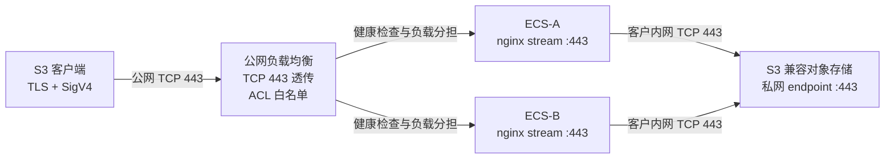

# s3-l4-proxy

简体中文 | [English](README.en.md) · [在线文档](https://scott987-cmd.github.io/s3-l4-proxy/)

四层（TCP 443 透传）代理工具包，用于从客户网络之外访问 **S3 兼容对象存储的私网 endpoint**。

四层负载均衡把 TCP 443 转发到客户 ECS 上的 `nginx stream`，ECS 再经客户内网转发到对象存储私网 endpoint。代理**不终结 TLS**、**不修改 HTTP/S3 请求**、**不保存对象存储凭证**——客户端到存储桶的加密和签名保真是端到端的。



因为数据面是裸 TCP，所以厂商中立。已验证的实现转发到火山 TOS；只要客户端 hostname、TLS 证书、签名算法和后端私网 endpoint 相互匹配，同一套代理也能转发到 AWS S3、阿里 OSS、华为 OBS、MinIO 或 Ceph RGW。

## 方案优势

**性能：代理不构成瓶颈。** 不解密、不重组、不解析 HTTP、不重新计算签名，没有 TLS 终结与二次握手，也没有应用层缓冲。实测单连接 78–98 MB/s，已接近测试实例网卡上限——转发本身不带来额外损耗；要更高吞吐，换更大带宽的实例即可线性提升。

**稳定性：故障面小到可以穷举。** 代理机不持证书，就没有证书过期与轮换引发的故障；不持凭证，就没有密钥失效类故障；无会话状态，则单节点异常只需被健康检查摘除，连接重建即可恢复。固定 upstream 消除了变量式 `proxy_pass` 导致的周期性连接重置，跨可用区 N+1 与失败自动回滚兜住剩余风险。

**人力：部署一条命令，日常一条命令。** 部署、巡检、验收、运维各一条命令，`health` 的退出码 0/1/2 可直接接入监控告警。证书轮换零动作、密钥轮换零动作、后端 DNS 变更由定时器自动跟进、扩容只是把同一份配置装到新节点再加进负载均衡——没有需要人盯着的周期性操作。

**成本：全开源，无授权费用。** 数据面只依赖发行版官方仓库的 nginx 与 `ngx_stream_module`：无闭源组件、无 license 费用、无按量计费的中间件、无厂商锁定。全部资源开销就是两台 ECS 与一个公网负载均衡；不解密不解析，CPU 花在网络 I/O 上，普通规格实例即可承载。

**兼容性：不解析协议，就没有「适配某个厂商」这件事。** 厂商在签名算法变体、path-style 与 virtual-hosted 寻址、私有扩展头、非标准错误响应体、自有鉴权机制上的差异，全部原样透传。任何需要**理解** S3 协议的中间件都必须逐个厂商适配这些方言，而中小厂商与自建存储（MinIO、Ceph RGW）恰恰在这些点上差异最大——本方案不解析，因此不存在「该厂商尚未适配」的问题。能不能通，只取决于客户端与对象存储两端自己是否谈得拢，与代理无关。

## 快速开始

在 ECS 代理节点上：

```bash
cp config.example.env config.env
# 填写 S3_BACKEND_HOST、S3_BACKEND_PORT、S3_CLIENT_HOST、S3_REGION、LISTEN_PORT、LB_IP
sudo bash scripts/install_l4_proxy.sh CONFIG=config.env
bash scripts/verify_l4_proxy.sh -c config.env
```

在能访问负载均衡 VIP/EIP 的客户端机器上：

```bash
S3_ACCESS_KEY=... S3_SECRET_KEY=... LB_IP=<lb-ip> \
S3_CLIENT_HOST=<签名用的 host> S3_REGION=<region> \
  bash scripts/speed_test_l4.sh
```

测试把 `S3_CLIENT_HOST` 同时作为 TLS SNI 和签名 host，只用 curl `--resolve` 把 TCP 强制指向负载均衡——证书校验与 host 签名语义都得以保留。

## 一键运维

```bash
# 部署
sudo bash scripts/install_l4_proxy.sh CONFIG=config.env

# 巡检（只读）
bash scripts/verify_l4_proxy.sh -c config.env

# 验收——加 RUN_SPEED=1 会经负载均衡做真实 PUT/GET/MD5
S3_ACCESS_KEY=... S3_SECRET_KEY=... \
  bash scripts/acceptance_l4_proxy.sh CONFIG=config.env RUN_SPEED=1

# 日常运维
bash scripts/ops_l4_proxy.sh status   CONFIG=config.env
bash scripts/ops_l4_proxy.sh health   CONFIG=config.env
sudo bash scripts/ops_l4_proxy.sh reload  CONFIG=config.env
sudo bash scripts/ops_l4_proxy.sh restart CONFIG=config.env
bash scripts/ops_l4_proxy.sh upstream CONFIG=config.env
bash scripts/ops_l4_proxy.sh conns    CONFIG=config.env

# 紧急解除出向锁定
sudo bash scripts/ops_l4_proxy.sh unlock-egress CONFIG=config.env

# 打交付包 -> dist/s3-l4-proxy.tgz
bash scripts/package_l4_proxy.sh
```

## 文件说明

| 路径 | 用途 |
| --- | --- |
| `config.example.env` | 本地测试或部署前复制为 `config.env`。 |
| `scripts/install_l4_proxy.sh` | 按需装 nginx，再配置 L4 代理，最后自动巡检。 |
| `scripts/deploy_nginx.sh` | CentOS/RHEL 与 Debian/Ubuntu 上的 nginx 及 stream 模块安装。 |
| `scripts/configure_l4_proxy.sh` | 写 nginx stream 配置、加固、reload——带备份与回滚。 |
| `scripts/verify_l4_proxy.sh` | 只读节点巡检。 |
| `scripts/ops_l4_proxy.sh` | 日常运维入口。 |
| `scripts/acceptance_l4_proxy.sh` | 生产验收编排。 |
| `scripts/speed_test_l4.sh` | 经负载均衡的 S3 PUT/GET/DELETE 吞吐与完整性测试。 |
| `scripts/diag_clb_l4.sh` | 免凭证的负载均衡/后端连通性诊断。 |
| `scripts/package_l4_proxy.sh` | 打交付包，内置密钥扫描，命中即构建失败。 |
| `templates/nginx-main.conf` | 专用代理机的完整 nginx 主配置（可选）。 |
| `templates/s3-stream.conf` | 实际部署的 stream 代理配置模板。 |
| `templates/nginx-s3-proxy.conf` | 独立参考配置，供阅读而非直接部署。 |
| `templates/dns-reload.{service,timer}` | 刷新后端 DNS 的平滑 reload 定时器。 |
| `templates/sysctl.conf`、`templates/logrotate.conf` | 网络基线与日志轮转。 |

## 使用前提

1. ECS 能解析并访问 `S3_BACKEND_HOST:S3_BACKEND_PORT`——生产环境务必用**私网** endpoint。
2. 客户端用 `S3_CLIENT_HOST` 做 TLS SNI 与请求签名，同时由 DNS（公网、私有或受控解析）把该 hostname 指向负载均衡。
3. 对象存储返回的证书覆盖 `S3_CLIENT_HOST`，或厂商提供等价的 endpoint/SNI 组合。
4. 客户端产生的认证协议被目标 endpoint 接受——region、service 与 endpoint family 必须匹配。
5. 负载均衡监听为 TCP（四层）；链路上任何设备都不修改 TLS 或应用层请求。
6. 生产至少两台跨可用区 ECS，配 TCP 健康检查与 N+1 容量冗余。

## 不适用的场景

- 需要虚拟 AK/SK 转换、STS 获取、凭证托管、代签或重签。
- 需要改写 Host/path、path-style ↔ virtual-hosted 转换、跨厂商协议转换。
- 需要 HTTP WAF、Header/Body 检查、对象级限流、租户鉴权、对象级审计或内容扫描。
- 客户端 hostname 不被后端证书覆盖，且无法建立兼容的 endpoint/SNI 关系。
- 环境无法提供负载均衡 ACL、安全组白名单或多后端高可用（裸露单台 ECS 公网 IP 不是可接受的替代）。

## 安全模型

| 层级 | 控制点 | 生产要求 |
| --- | --- | --- |
| 数据层 | 客户端侧加密 | 敏感数据出客户端机房前用客户 KMS 加密，代理与存储侧只接触密文。 |
| 传输层 | 端到端 TLS | 负载均衡与 nginx 都不终结 TLS，代理机不存证书和私钥。 |
| 接入层 | 负载均衡 ACL 与安全组 | 只放行客户端固定出口 IP；ECS 443 只接受负载均衡/批准来源。 |
| 代理层 | 主机与出向收敛 | 专用主机只监听 443/22；出向仅允许 DNS、运维依赖和存储私网 endpoint。 |
| 存储层 | 最小权限与来源限制 | 专用子账号/角色只授权目标桶必要动作；桶策略绑定代理真实来源地址。 |

- **对多数客户已经足够。** 鉴权与对象级审计的权威点本来就在对象存储自身——IAM 主体、桶策略、审计日志都在那一侧完整生效，代理层不重复实现并不等于能力缺失。反过来，任何在链路中间解密的做法都会新增一个同时持有明文与密钥的组件，也就多出一个必须防守、轮换、审计的位置。
- **四层可见性边界。** 代理看不到加密后的 HTTP/S3 语义，因此不在代理侧记录 bucket、object key、access key 或请求动作，`nginx stream` 只记录来源、时长、字节数、状态和上游地址。对象级追溯取自客户端与对象存储审计日志；代理不重复采集，也就不引入新的数据留存面。
- 生成的 stream 配置中**不含 `ssl`/`ssl_certificate` 指令**；一旦渲染出变量式 `proxy_pass`，`configure_l4_proxy.sh` 会直接让本次运行失败。
- **PROXY protocol 默认关闭。** 只有负载均衡监听明确启用时才设 `ENABLE_PROXY_PROTOCOL=1`——两端不一致会让普通 TLS 客户端全部连不上。
- **出向锁定默认关闭**，以免让有其他出网依赖的主机失联。启用时使用独立的 `S3_L4_EGRESS` 链，绝不清空既有 `OUTPUT` 规则，可用 `ops_l4_proxy.sh unlock-egress` 撤销。
- **凭证不进仓库。** `config.example.env` 只有占位符，`.gitignore` 拦截 `config.env`，`package_l4_proxy.sh` 在密钥形态字符串或私钥进入交付包时让构建失败。验收脚本只从进程环境读 AK/SK——注意 `speed_test_l4.sh` 会把它们传给 `curl --aws-sigv4 --user`，在共享主机上会短暂出现在进程列表里，请使用专用最小权限测试凭证。

## 安装脚本做了什么

- 处理 CentOS/RHEL 与 Debian/Ubuntu 上的 nginx 与动态 `stream` 模块。
- 在改动任何东西**之前**，把 nginx 配置、systemd limits、sysctl、logrotate 和 iptables 备份到 `/var/backups/s3-l4-proxy/<时间戳>`；任一步骤或 `nginx -t` 失败即自动全量回滚。
- 设置 `worker_rlimit_nofile` / systemd `LimitNOFILE`（默认 65535）、网络 sysctl 基线、stream 访问日志与日志轮转。
- 安装 `s3-l4-dns-reload.timer`，每 5 分钟平滑 reload 一次 nginx。

> 专用代理机默认 `MAIN_MODE=replace`，会安装已知良好的 stream-only nginx 主配置（先备份）。与既有 nginx HTTP 服务混部时，必须显式设置 `MAIN_MODE=auto` 和 `DEDICATED_PROXY_HOST=0`，并单独评审端口与变更影响。

### 设计说明：upstream 为什么不能是变量

早期版本用变量式 stream upstream（`proxy_pass $endpoint:443`），这会走 nginx stream 的运行时 resolver 路径，实测出现约 5 秒周期的连接重置。本工具包改用固定的 `upstream s3_backend` 块，由 nginx 在启动/reload 时解析一次。代价是后端 DNS 变化需要 reload——这正是 DNS reload 定时器要解决的问题。

## 厂商兼容性

代理只搬运 TCP 字节，厂商差异原样透传，因此对长尾对象存储的兼容性风险在网络层被降到最低——不存在「该厂商尚未适配」的问题。

需要注意的是，这里说的兼容是 **TCP/TLS 数据面**兼容：能不能通取决于客户端与对象存储两端是否谈得拢（证书是否覆盖 client host、认证协议是否被接受），代理不参与也无法补救。上线前必须用客户真实 SDK/CLI 验证 PUT、GET、HEAD、Multipart 与完整性。

| 对象存储 | 结论 | 校验重点 |
| --- | --- | --- |
| 火山 TOS | 已真实环境验证 | 使用 `tos-s3-*` endpoint family；service 为 `s3`。 |
| AWS S3 / S3 VPC endpoint | 设计上兼容 | endpoint、region、service，以及证书覆盖的 client host。 |
| 阿里 OSS | TCP 层兼容 | 确认客户端使用 OSS 支持的认证协议或其 S3 兼容模式。 |
| 华为 OBS | TCP 层兼容 | 确认 endpoint、证书与签名算法一致。 |
| MinIO / Ceph RGW | 通常兼容 | 私有 CA 信任、path-style 与 virtual-hosted、SigV4 配置。 |

`speed_test_l4.sh` 用 curl SigV4，适用于兼容 AWS SigV4 的 endpoint。厂商特有认证请改用厂商 CLI/SDK，但保持同样的负载均衡 hostname 解析路径。

## 可观测性

| 维度 | 指标 | 建议告警 |
| --- | --- | --- |
| 存活 | nginx、443 监听、负载均衡健康后端数 | 任一节点不可用或健康后端不足 N+1 |
| 连接 | ESTABLISHED、TIME_WAIT、连接失败 | 超过设计容量 80% |
| 吞吐 | 网卡 in/out bps、stream bytes | 持续逼近实例带宽 80% |
| 时延 | `upstream_connect_time`、`session_time` | 连接 P99 超过容量基线 |
| 资源 | CPU、内存、文件句柄、丢包 | CPU 或句柄超过 80% |

stream 访问日志：`/var/log/nginx/s3-stream.log`（每日轮转，保留 15 份）。

## 生产准入清单

- [ ] 至少两台跨可用区 ECS 挂同一公网负载均衡
- [ ] 负载均衡 TCP 健康检查指向与业务相同的 `LISTEN_PORT`
- [ ] 负载均衡 ACL 与 ECS 安全组只放行客户端固定出口 / 负载均衡的 443 入向
- [ ] nginx `stream` 模块已加载且 `nginx -t` 通过
- [ ] 生效配置使用 `proxy_pass s3_backend`，不是 `proxy_pass $...`
- [ ] `worker_rlimit_nofile` 与 systemd `LimitNOFILE` 不低于 65535
- [ ] `/var/log/nginx/s3-stream.log` 已采集并轮转
- [ ] `s3-l4-dns-reload.timer` 已启用，后端 DNS 变更能被感知
- [ ] `ENABLE_PROXY_PROTOCOL` 与负载均衡监听两端一致
- [ ] 出向锁定仅在核对完 DNS、SSH、监控与后端放行规则后启用
- [ ] 对象存储主体、桶/对象资源与来源 IP 策略已在控制台保存验证
- [ ] 经负载均衡的真实 S3 PUT/GET/MD5 在切流前通过
- [ ] 容量压测达到峰值需求并保留冗余

## 已知限制

- nginx 只在启动/reload 时解析非变量 upstream 的 hostname——后端 DNS 变更需要 reload（定时器已代劳）。
- 代理无状态；生产环境请在负载均衡后至少放两个节点。
- `curl --aws-sigv4` 仅用于验证；生产流量使用客户端自己的签名库。
- 四层之下对象存储看到的是**代理**的来源地址，不是原始客户端的。写来源 IP 桶策略前，先从存储审计日志确认真实值。

## 文档

- [完整生产方案（中文）](docs/DESIGN.zh-CN.md) — 安全边界、TOS 桶策略示例、验证记录、准入清单
- [配置参考](docs/CONFIGURATION.md) — 每个环境变量的含义、默认值与优先级
- [运维手册](docs/OPERATIONS.md) — 日常巡检、扩缩容、变更与应急
- [故障排查](docs/TROUBLESHOOTING.md) — 症状 → 原因 → 处理
- [安全策略](SECURITY.md) — 威胁模型、控制项与漏洞上报
- [贡献指南](CONTRIBUTING.md)

## 免责声明

本项目按「现状」提供，不附带任何明示或默示担保。文档中的吞吐与验证结果来自特定环境的一次实测，**不构成性能承诺**，容量结论须以你自己环境的压测为准。部署脚本会修改 nginx 配置、systemd、sysctl 与防火墙规则——请先在非生产环境演练。厂商兼容性指 TCP/TLS 数据面兼容，上线前必须用你自己的 SDK/CLI 完成功能与完整性验证。安全与合规责任由使用者自行承担；本项目与任何云服务商或对象存储厂商无隶属或背书关系。

完整条款见 [DISCLAIMER.md](DISCLAIMER.md)。

## 许可

[Apache-2.0](LICENSE)
