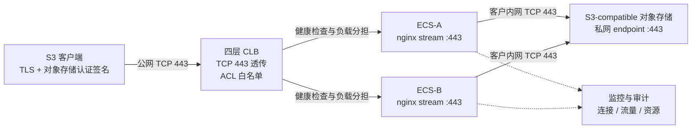

# 通用 S3 四层代理（L4 TCP 透传）生产方案

> **方案结论：** 使用四层 CLB TCP 443 透传与 nginx stream，将 S3 客户端流量转发到客户网络中的 S3-compatible 对象存储私网 endpoint。代理不终结 TLS、不修改 HTTP/S3 请求、不保存对象存储凭证，客户端到对象存储保持端到端加密和认证签名保真。

## 一、方案定位

本方案用于「SaaS 侧通过互联网点对点访问客户私有对象存储」的场景。SaaS 机房通过固定公网出口访问客户 CLB，CLB 将 TCP 443 流量分发到客户 ECS 上的 nginx stream，ECS 再通过客户内网访问对象存储私网 endpoint。



### 1.1 核心特征

- **端到端 TLS：** CLB 和 nginx 均不解密，代理主机不部署对象存储证书或私钥。
- **认证保真：** Host、SNI、path、query、Authorization、请求体及签名头保持原样。
- **无状态扩展：** nginx stream 不保存会话状态，可通过增加 ECS 横向扩容。
- **通用 S3 数据面：** 网络层不绑定具体厂商；厂商兼容性由 endpoint、证书、寻址模式和认证协议决定。

### 1.2 方案优势

**性能：代理不构成瓶颈。** 不解密、不重组、不解析 HTTP、不重新计算签名，没有 TLS 终结与二次握手。实测单连接 78–98 MB/s，已接近测试实例网卡上限——转发本身不带来额外损耗；要更高吞吐，换更大带宽的实例即可线性提升。

**稳定性：故障面小到可以穷举。** 不持证书就没有证书过期与轮换引发的故障；不持凭证就没有密钥失效类故障；无会话状态则单节点异常只需被健康检查摘除，连接重建即可恢复。固定 upstream 消除了变量式 `proxy_pass` 导致的周期性连接重置，跨可用区 N+1 与失败自动回滚兜住剩余风险。

**人力：部署一条命令，日常一条命令。** 部署、巡检、验收、运维各一条命令，`health` 的退出码可直接接入监控。证书轮换零动作、密钥轮换零动作、后端 DNS 变更由定时器自动跟进、扩容只是把同一份配置装到新节点再加进 CLB。

**成本：全开源，无授权费用。** 数据面只依赖发行版官方仓库的 nginx 与 `ngx_stream_module`：无闭源组件、无 license 费用、无按量计费的中间件、无厂商锁定。全部资源开销就是两台 ECS 与一个四层 CLB。

## 二、使用前提与不适用场景

### 2.1 使用前提

1. ECS 能通过客户 DNS 解析并访问 `S3_BACKEND_HOST:S3_BACKEND_PORT`，生产优先使用对象存储私网 endpoint。
2. 客户端使用 `S3_CLIENT_HOST` 完成 TLS SNI 与请求签名，同时由正式 DNS、私有 DNS 或受控解析将该 hostname 路由到 CLB。
3. 对象存储返回的证书覆盖 `S3_CLIENT_HOST`，或厂商提供等价的 endpoint/SNI 组合。
4. 客户端产生的认证协议被目标 endpoint 接受；region、service 和 endpoint family 必须匹配。
5. CLB 使用 TCP 四层监听，任何中间设备都不修改 TLS 或应用层请求。
6. 生产至少两台跨可用区 ECS，配置 TCP 健康检查和 N+1 容量冗余。

### 2.2 不适用场景

- 需要虚拟 AK/SK 转换、STS 获取、凭证托管、代理代签或重签。
- 需要改写 Host/path、path-style 与 virtual-hosted 转换或跨厂商协议转换。
- 需要 HTTP WAF、Header/Body 检查、对象级限流、租户鉴权、对象级审计或内容扫描。
- 客户端 hostname 不被后端证书覆盖，且无法建立兼容的 endpoint/SNI 关系。
- 客户端无法生成目标对象存储要求的认证协议。
- 无法配置 CLB ACL、安全组白名单和多后端高可用，只能裸露单台 ECS 公网地址。

## 三、安全设计

### 3.1 安全边界

| 层级 | 控制点 | 生产要求 |
| --- | --- | --- |
| 数据层 | 客户端侧数据加密 | 敏感数据出客户端机房前使用客户 KMS 加密，代理与存储侧只接触密文。 |
| 传输层 | 端到端 TLS | CLB 与 nginx 不终结 TLS，不保存证书和私钥。 |
| 接入层 | CLB ACL 与安全组 | 只放行客户端固定出口 IP；ECS 443 只接受 CLB/批准来源。 |
| 代理层 | 主机与出向收敛 | 专用主机只监听 443/22；出向仅允许 DNS、运维依赖和对象存储私网 endpoint。 |
| 存储层 | 最小权限与来源限制 | 专用子账号/角色只授权目标桶必要动作；桶策略限制代理实际来源地址。 |

### 3.2 L4 可见性限制

鉴权与对象级审计的权威点本来就在对象存储自身——IAM 主体、桶策略、审计日志都在那一侧完整生效，代理层不重复实现并不等于能力缺失。反过来，任何在链路中间解密的做法都会新增一个同时持有明文与密钥的组件，多出一个必须防守、轮换、审计的位置。本方案不解密、不持凭证、不存私钥，攻破代理机既拿不到数据也拿不到密钥，只能拿到一条被 ACL、安全组和桶策略三重收敛过的网络可达性。**因此对绝大多数场景，四层的安全性已经足够。**

> ❗ 需要知道的边界：L4 代理看不到加密后的 HTTP/S3 语义，因此不在代理侧记录 bucket、object key、access key 或请求动作。nginx stream 只记录连接来源、连接时长、字节数、状态和上游地址。对象级追溯取自客户端与对象存储审计日志。

### 3.3 PROXY protocol

仅当 CLB 监听明确启用 PROXY protocol 时，nginx 才设置 `ENABLE_PROXY_PROTOCOL=1`。两端配置不一致会导致普通 TLS 客户端无法连接。默认关闭。

### 3.4 TOS 桶策略示例（供应商特定）

> ❗ **先确认实际来源：** 四层代理下 TOS 看到的是 ECS 访问私网 endpoint 时使用的源地址/网段，不是客户端出口 IP，也不一定是 ECS 公网 IP。必须通过 TOS 审计日志或网络设计确认 `volc:SourceIp` 的真实值。

TOS Bucket Policy：桶级与对象级权限拆分

```json
{
  "Statement": [
    {
      "Sid": "AllowBucketMetadataFromProxy",
      "Effect": "Allow",
      "Principal": [
        "<账号ID>/<IAM用户名>"
      ],
      "Action": [
        "tos:ListBucket",
        "tos:HeadBucket"
      ],
      "Resource": [
        "trn:tos:::<bucket-name>"
      ],
      "Condition": {
        "IpAddress": {
          "volc:SourceIp": [
            "<代理 ECS 访问 TOS 时的实际来源 CIDR>"
          ]
        }
      }
    },
    {
      "Sid": "AllowObjectsFromProxy",
      "Effect": "Allow",
      "Principal": [
        "<账号ID>/<IAM用户名>"
      ],
      "Action": [
        "tos:GetObject",
        "tos:PutObject"
      ],
      "Resource": [
        "trn:tos:::<bucket-name>/*"
      ],
      "Condition": {
        "IpAddress": {
          "volc:SourceIp": [
            "<代理 ECS 访问 TOS 时的实际来源 CIDR>"
          ]
        }
      }
    }
  ]
}
```

- **Principal：** TOS 桶策略使用字符串数组，不使用 `{"TRN":[...]}` 对象。生产值应从 TOS 控制台主体选择器生成并保存校验。
- **资源粒度：** `ListBucket/HeadBucket` 使用桶资源；`GetObject/PutObject` 使用 `bucket/*` 对象资源。
- **条件键：** 来源 IP 使用 `volc:SourceIp`，不要使用 `tos:SourceIp`。
- **删除权限：** 仅业务明确需要时增加 `tos:DeleteObject`。
- **避免锁死：** 默认隐式拒绝已提供兜底。不要默认叠加 `Deny + Principal:"*" + NotIpAddress`，显式 Deny 会覆盖 Allow。

## 四、厂商兼容性

本方案的兼容是 TCP/TLS 数据面兼容，不代表不同厂商认证协议天然互通。最终上线必须使用客户真实 SDK/CLI 完成 PUT、GET、HEAD、Multipart 与完整性验证。

| 对象存储 | 结论 | 校验重点 |
| --- | --- | --- |
| 火山 TOS | 已真实验证 | 使用 `tos-s3-*` endpoint family；service 为 `s3`。 |
| AWS S3 | L4 数据面兼容 | S3/VPC endpoint、region、service 与证书覆盖的 client host。 |
| 阿里 OSS | TCP 透传兼容 | 确认客户端使用 OSS 支持的认证协议或兼容模式。 |
| 华为 OBS | TCP 透传兼容 | 确认 endpoint、证书和签名算法一致。 |
| MinIO / Ceph RGW | 通常兼容 | 私有 CA、path-style/virtual-hosted 和 SigV4 配置。 |

## 五、软件包与一键使用

### 5.1 软件包能力

- CentOS/RHEL、Debian/Ubuntu nginx 与动态 stream 模块适配。
- 固定 upstream，避免变量式 `proxy_pass` 的周期性连接重置。
- 配置前备份；失败自动回滚 nginx、systemd limit、sysctl 和独立防火墙链。
- 专用 `S3_L4_EGRESS` 防火墙链，不清空企业已有 OUTPUT 规则。
- systemd 托管、句柄上限、sysctl、stream 日志、logrotate。
- 每 5 分钟平滑 reload nginx，刷新非变量 upstream 的 DNS 解析结果。
- 一键部署、一键巡检、一键验收、一键运维和打包密钥扫描。

### 5.2 一键部署

```bash
cp config.example.env config.env
# 填写 S3_BACKEND_HOST / S3_BACKEND_PORT / S3_CLIENT_HOST / S3_REGION / CLB_IP
sudo bash scripts/install_l4_proxy.sh CONFIG=config.env
```

专用代理机默认 `MAIN_MODE=replace`，安装已知的 stream-only nginx 主配置。与现有 nginx HTTP 服务混部时，必须显式设置 `MAIN_MODE=auto` 和 `DEDICATED_PROXY_HOST=0`，并单独评审端口与变更影响。

### 5.3 一键巡检与验收

```bash
bash scripts/verify_l4_proxy.sh -c config.env

S3_ACCESS_KEY=... S3_SECRET_KEY=... \
  bash scripts/acceptance_l4_proxy.sh CONFIG=config.env RUN_SPEED=1
```

仓库和 `config.example.env` 不包含 AK/SK。真实凭证只在验收进程环境中临时提供。

### 5.4 一键运维

```bash
bash scripts/ops_l4_proxy.sh status CONFIG=config.env
bash scripts/ops_l4_proxy.sh health CONFIG=config.env
sudo bash scripts/ops_l4_proxy.sh reload CONFIG=config.env
sudo bash scripts/ops_l4_proxy.sh restart CONFIG=config.env
bash scripts/ops_l4_proxy.sh upstream CONFIG=config.env
bash scripts/ops_l4_proxy.sh conns CONFIG=config.env
```

## 六、生产部署与运维基线

### 6.1 高可用与容量

- 至少两台跨可用区 ECS 挂同一四层 CLB。
- CLB 使用 TCP 业务端口健康检查，建议间隔 5 秒、超时 3 秒、健康/不健康阈值 3 次。
- 容量按峰值带宽、并发连接和单机网卡能力规划，预留 N+1 冗余。
- 新增 ECS 使用同一配置加入 CLB 即可，无需迁移代理状态。

### 6.2 可观测性

| 维度 | 指标 | 建议告警 |
| --- | --- | --- |
| 存活 | nginx、443 监听、CLB 健康后端数 | 任一节点不可用或健康后端不足 N+1 |
| 连接 | ESTABLISHED、TIME_WAIT、连接失败 | 连接数超过设计容量 80% |
| 吞吐 | 网卡 in/out bps、stream bytes | 持续逼近实例带宽 80% |
| 时延 | upstream_connect_time、session_time | 连接 P99 超过容量基线 |
| 资源 | CPU、内存、文件句柄、丢包 | CPU/句柄超过 80% |

### 6.3 变更与回滚

- 配置脚本在 `/var/backups/s3-l4-proxy/` 创建运行级备份。
- `nginx -t` 失败或配置过程报错时自动恢复 nginx、systemd、sysctl 与防火墙状态。
- 固定 upstream 在 nginx 启动/reload 时解析；软件包安装 systemd timer 每 5 分钟平滑 reload 刷新 DNS。
- 出向锁定默认关闭。启用前确认 DNS、SSH、监控和其他必要依赖；通过独立链实现，不覆盖企业已有规则。

## 七、真实验证结果

> 以下为一次真实环境的验证记录，具体地址已脱敏为占位符。

### 7.1 软件包验证

在重装后的 CentOS Stream 9 ECS 上从压缩包解压执行一键部署：

- ECS 公网地址：`<ECS_PUBLIC_IP>`；私网地址：`<ECS_PRIVATE_IP>`。
- 公网 CLB EIP：`<CLB_EIP>`。
- nginx 1.20.1 + 动态 stream 模块。
- 只监听业务 443 与 SSH 22。
- 巡检：`PASS=20 WARN=1 FAIL=0`。唯一 WARN 是按安全默认未启用出向锁定。
- DNS reload timer 已启用，每 5 分钟平滑刷新 upstream 解析。

### 7.2 网络与业务验证

- ECS 解析并访问 TOS 私网 endpoint `tos-s3-cn-beijing.ivolces.com:443` 成功。
- ECS 本机经 `127.0.0.1:443` 穿透 nginx 到对象存储，TLS 成功并返回上游 HTTP 403，证明代理未终结 TLS。
- 公网经 CLB EIP 真实 S3 验证：1MB PUT=200、GET=200、MD5 一致。
- 最终复测 PUT 4.40 MB/s、GET 5.00 MB/s；该小对象结果用于功能验证，不作为容量基线。
- 历史大对象实测 100MB/500MB 单连接约 78–98 MB/s，瓶颈接近测试 ECS 网卡上限。
- DELETE=403 是测试凭证未授予删除权限，符合最小权限设计。

## 八、生产准入清单

- [ ] 至少两台跨可用区 ECS，CLB 健康后端满足 N+1
- [ ] CLB 使用 TCP 透传，ACL 仅允许客户端固定出口 IP
- [ ] ECS 443 仅允许 CLB/批准来源，未直接对全互联网开放
- [ ] ECS 可解析并访问对象存储私网 endpoint
- [ ] S3_CLIENT_HOST、证书、SNI、签名 region/service/endpoint family 已核对
- [ ] 对象存储主体、桶/对象资源和来源 IP 策略已在控制台保存验证
- [ ] nginx 使用非变量 upstream，stream 模块、nofile、sysctl、logrotate 已生效
- [ ] 监控告警、日志采集、变更回滚和应急操作已演练
- [ ] 使用客户真实 SDK/CLI 完成 PUT/GET/HEAD/Multipart 与完整性验证
- [ ] 容量压测达到峰值需求并保留冗余
